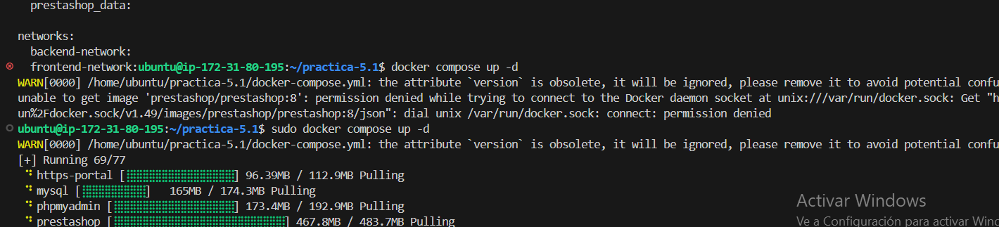
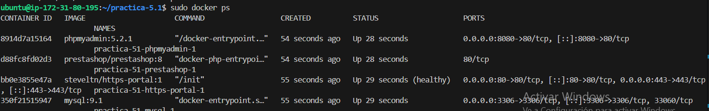
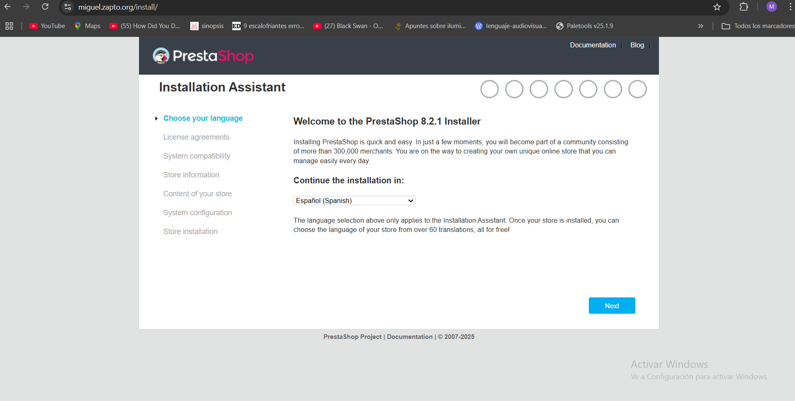

# practica-5.1

En esta práctica usaremos docker y docker compose.

EL primer paso que realizaremos sera crear una instancia con 20 gb de almacenamiento,aignarle una ip elástica y permitir el trafico http,https y ssh.  una vez creada,instalaremos docker y docker compose.
Una vez descargado e instalado,procederemos a crear nuestro archivo de variable donde pondremos nuestro archivo de variables.

````
MYSQL_ROOT_PASSWORD=root
MYSQL_DATABASE=prestashop
MYSQL_USER=user
MYSQL_PASSWORD=password
DOMAIN=miguel.zapto.org
````

También , modificaremos el docker-compose.yml
````
version: '3.4'

services:
  mysql:
    image: mysql:9.1
    ports: 
      - 3306:3306
    environment: 
      - MYSQL_ROOT_PASSWORD=${MYSQL_ROOT_PASSWORD}
      - MYSQL_DATABASE=${MYSQL_DATABASE}
      - MYSQL_USER=${MYSQL_USER}
      - MYSQL_PASSWORD=${MYSQL_PASSWORD}
    volumes: 
      - mysql_data:/var/lib/mysql
    networks: 
      - backend-network
    restart: always
  
  phpmyadmin:
    image: phpmyadmin:5.2.1
    ports:
      - 8080:80
    environment: 
      - PMA_ARBITRARY=1
    networks: 
      - backend-network
      - frontend-network
    restart: always
    depends_on: 
      - mysql

  prestashop:
    image: prestashop/prestashop:8
    environment: 
      - DB_SERVER=mysql
    volumes:
      - prestashop_data:/var/www/html
    networks: 
      - backend-network
      - frontend-network
    restart: always
    depends_on: 
      - mysql

  https-portal:
    image: steveltn/https-portal:1
    ports:
      - 80:80
      - 443:443
    restart: always
    environment:
      DOMAINS: "${DOMAIN} -> http://prestashop:80"
      STAGE: 'production' # Don't use production until staging works
      # FORCE_RENEW: 'true'
    networks:
      - frontend-network

volumes:
  mysql_data:
  prestashop_data:

networks: 
  backend-network:
  frontend-network:
  ````

  ejecutamos udo docker compose up -d y comenzará a descragar las imágenes.

  

  Luego ejecutamos docker ps para ver todos los contenedores.



Por último accedemos a nuestro dominio:
